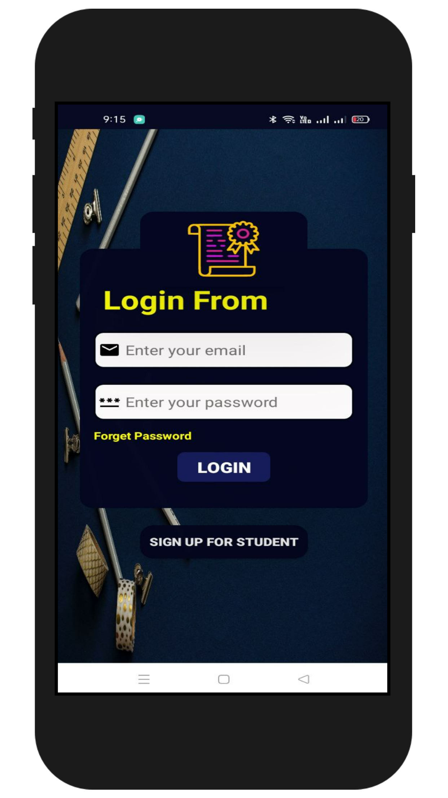
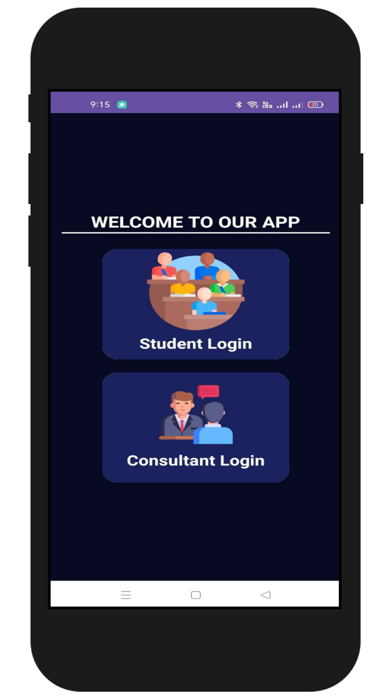
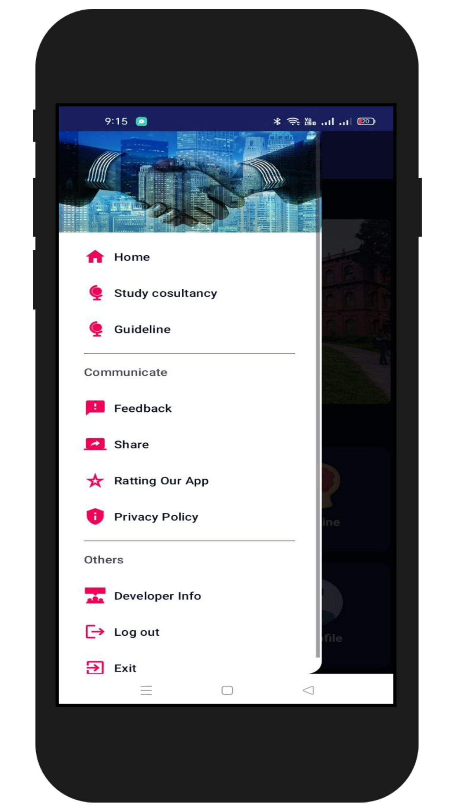
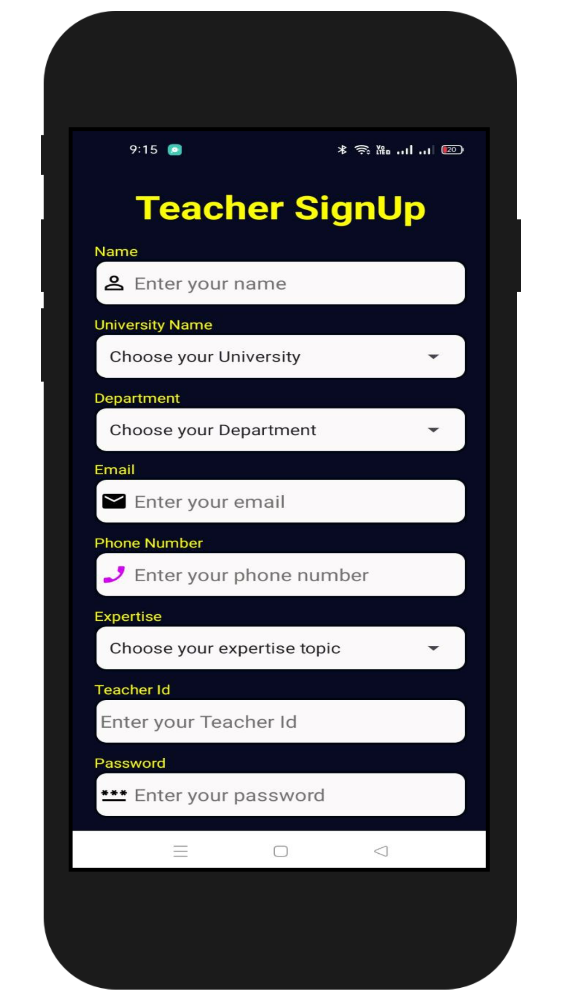
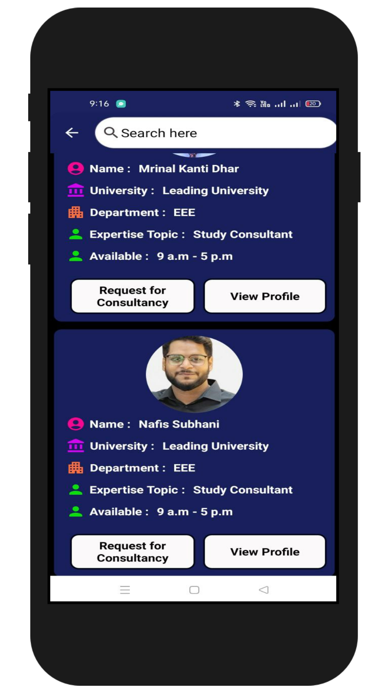
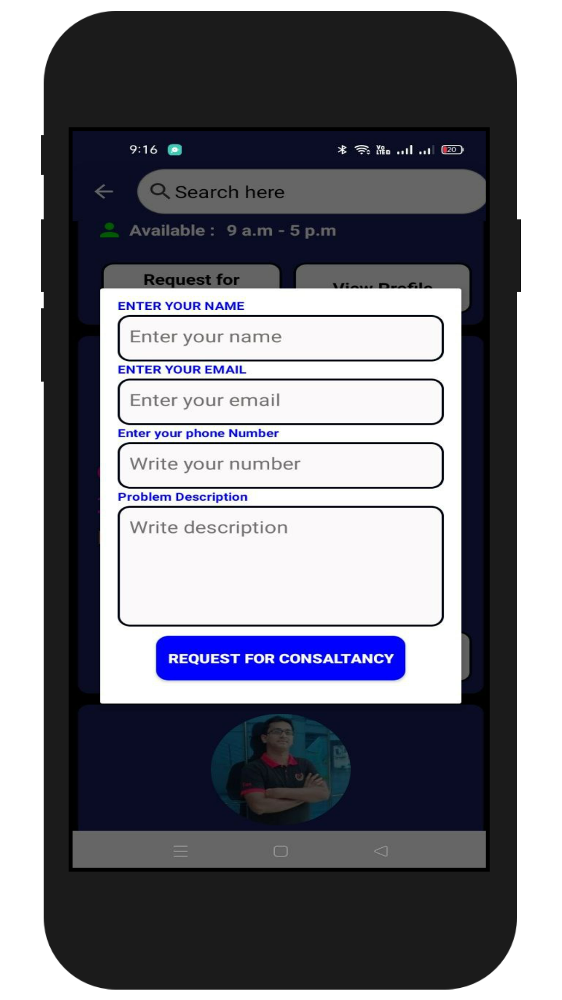
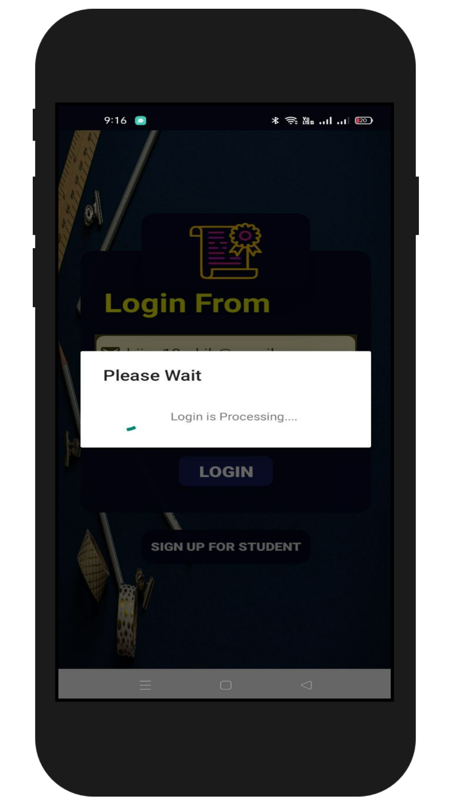
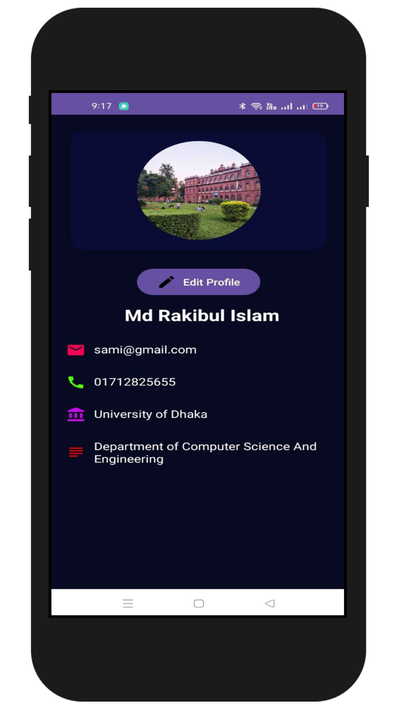

# Zero_Xp_LU_Hackathon
# Expertise Connector Android App

The Expertise Connector Android app is a platform that facilitates the connection between expertise consultant teachers, expertise categories, and students. It allows students to find and connect with teachers who possess expertise in specific categories, enhancing the learning experience.

## Table of Contents

- [Features](#features)
- [Screenshots](#screenshots)
- [Installation](#installation)
- [Usage](#usage)
- [Contributing](#contributing)
- [License](#license)

## Features

- **Expertise Categories**: Categorize teachers based on their expertise areas.
- **Teacher-Student Connection**: Enable students to connect with teachers in their desired expertise category.
- **Profile Management**: Teachers and students can manage their profiles, including expertise, contact information, and availability.
- **Easy Communication**: Built-in communication features to facilitate easy interaction between teachers and students.

## Screenshots





## Installation

1. Clone this repository:
   ```bash
   git clone https://github.com/your-username/expertise-connector-android.git
